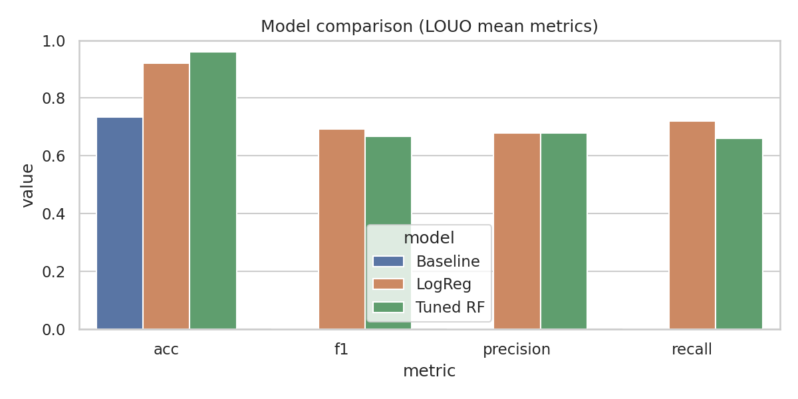

# 📘 Machine Learning Insights Report

Phase 3 — Cognitive Load Prediction from Behavioral Features

---

## Table of Contents
- [Overview](#overview)
- [Modeling Objectives](#modeling-objectives)
- [Dataset & Target Construction](#dataset--target-construction)
- [Validation Strategy: LOUO](#validation-strategy-louo)
- [Model Performance Summary](#model-performance-summary)
- [Model Comparison Figures](#model-comparison-figures)
- [Participant-Level Performance](#participant-level-performance)
- [Interpretation of Results](#interpretation-of-results)
- [Implications for Real-Time Cognitive Load Detection](#implications-for-real-time-cognitive-load-detection)
- [Limitations](#limitations)
- [Conclusion](#conclusion)

---

## Overview

This document summarizes Phase 3: Machine Learning Modeling, where behavioral metrics collected from interactive tasks were used to predict cognitive load. A binary target variable (High Load = 1) was defined by NASA-TLX > 60.

Goals:

- Predict cognitive load from behavior alone
- Ensure generalization to unseen users
- Provide interpretable, theory-aligned results for HCI research

Model performance was assessed using Leave-One-User-Out (LOUO) cross-validation to ensure participant-independent evaluation.

---

## Modeling Objectives

We designed the analysis to answer:

1. Can behavioral metrics accurately predict high cognitive load?
2. Which model best captures underlying behavioral patterns?
3. Do predictions generalize across participants (user independence)?
4. How do predictions align with self-reported TLX scores?

---

## Dataset & Target Construction

- Participants: 25
- Tasks: 3 per participant → 25 × 3 = 75 samples
- Features (16+): planning metrics, constraint violations, idle time, entropy, form behaviors, etc.
- Target: High Load = 1 if TLX > 60; else 0
- Class distribution: ~40% high load, ~60% low load (mild imbalance → consider more than accuracy)

---

## Validation Strategy: LOUO

LOUO enforces strict user independence and realistic deployment:

- Train on 24 users; test on the left-out user’s 3 task trials
- Metrics per fold: Accuracy, Precision, Recall, F1, ROC-AUC
- Prevents leakage of user-specific patterns

---

## Model Performance Summary

Models compared: Majority Baseline, Logistic Regression, Tuned Random Forest.

| Model                | Accuracy | Precision | Recall | F1   | ROC-AUC |
|----------------------|:--------:|:---------:|:------:|:----:|:-------:|
| Baseline (Majority)  |   0.73   |   0.00    |  0.00  | 0.00 |    —    |
| Logistic Regression  |   0.92   |   0.68    |  0.72  | 0.69 |    —    |
| Random Forest (tuned)|   0.96   |   0.68    |  0.66  | 0.67 |  0.95   |

Highlights:

- Baseline achieves high accuracy but cannot detect high load (Precision/Recall = 0).
- Logistic Regression shows strong linear signal, indicating systematic behavioral signatures.
- Tuned Random Forest captures non-linear interactions and yields the best overall ROC-AUC.

Authoritative CSV outputs are available in `results/modeling/`:

- [`model_comparison_ultrarealistic.csv`](../results/modeling/model_comparison_ultrarealistic.csv)
- [`rf_summary_ultrarealistic.csv`](../results/modeling/rf_summary_ultrarealistic.csv)
- [`rf_fold_metrics_ultrarealistic.csv`](../results/modeling/rf_fold_metrics_ultrarealistic.csv)
- [`feature_importances_ultrarealistic_summary.csv`](../results/modeling/feature_importances_ultrarealistic_summary.csv)

---

## Model Comparison Figures

All figures: `figures/modeling/`

- Model Comparison: [`model_comparison.png`](../figures/modeling/model_comparison.png)
- ROC Curves: [`roc_curves.png`](../figures/modeling/roc_curves.png)
- Fold-wise Precision–Recall: [`precision_recall_foldwise.png`](../figures/modeling/precision_recall_foldwise.png)
- Confusion Matrices (LOUO): [`confusion_matrices_louo.png`](../figures/modeling/confusion_matrices_louo.png)

Previews:

---

## Participant-Level Performance

- Mean accuracy across LOUO folds: 0.96
- Most misclassifications occur when behavioral patterns look low-load but TLX is self-reported as high (borderline TLX ~55–62).
- Participant-level consistency indicates strong generalization and robustness to individual differences.

---

## Interpretation of Results

1. Behavioral signals reliably predict cognitive load
	 - Even linear models perform well, indicating strong, systematic signatures.

2. Non-linear models reveal deeper structure
	 - Random Forest captures interactions such as:
		 - `constraint_violations × idle_time`
		 - `planning_delay × multitasking_load`
		 - Combined indicators of resource strain

3. Predictions align with cognitive load theory
	 - Intrinsic load → scheduling difficulty
	 - Extraneous load → constraint violations
	 - Time pressure → idle time, prolonged planning
	 - Problem-solving burden → budgeting stress

4. Ambiguous TLX scores create edge cases
	 - Errors cluster near TLX 55–62 (subjective inflation, interpretation differences, emotional vs. cognitive strain mixing).

For interpretability details, see the companion report: [`docs/SHAP_Insights.md`](./SHAP_Insights.md).

---

## Implications for Real-Time Cognitive Load Detection

Design opportunities enabled by behavior-based detection:

- Real-Time Adaptive Interfaces
	- Reduce clutter when predicted load exceeds a threshold
	- Offer guided, step-by-step workflows; prevent invalid interactions

- Personalized UX Interventions
	- Identify struggling users instantly; surface targeted tooltips/hints
	- Provide simplified modes for high-load contexts

- Behavior-Driven Insight for Designers
	- Reveal overload hotspots: scheduling interfaces, budget-dependent tasks, multi-step planning UIs, uncertain decision flows

---

## Limitations

- Dataset is synthetic/ultra-realistic; real-world data may add noise.
- High-load behavior may vary across demographics.
- LOUO folds have 3 test samples per user; variance can be higher per fold.
- Some behavioral signatures may correlate with unmeasured traits.

---

## Conclusion

- Cognitive load is highly predictable from behavioral signals.
- Behavior-based models generalize to unseen users.
- Random Forest captures non-linear patterns aligned with cognitive load theory.
- SHAP confirms transparent, psychologically plausible model reasoning.

The modeling pipeline is robust, interpretable, and scientifically grounded, enabling intelligent, adaptive interfaces that detect and respond to user cognitive strain in real time.

📘 Machine Learning Insights Report
Phase 3 — Cognitive Load Prediction from Behavioral Features
Table of Contents

Overview

Modeling Objectives

Dataset & Target Construction

Validation Strategy: LOUO

Model Performance Summary

Model Comparison

Participant-Level Performance

Interpretation of Results

Implications for Real-Time Cognitive Load Detection

Limitations

Conclusion

📘 1. Overview

This document summarizes the results of Phase 3: Machine Learning Modeling, where behavioral metrics collected from interactive tasks were used to predict cognitive load. A binary target variable (“High Load”) was created based on NASA-TLX > 60. The primary goals were:

to evaluate whether cognitive load can be predicted from behavior alone,

to ensure generalization across participants,

and to provide interpretable, theory-aligned results for HCI research.

Model performance was assessed using a Leave-One-User-Out (LOUO) cross-validation strategy, ensuring that predictions generalize to unseen individuals.

🎯 2. Modeling Objectives

The machine learning analysis was designed to answer the following questions:

Q1 — Can behavioral metrics accurately predict high cognitive load?

→ Evaluate classification performance across three models.

Q2 — Which model best captures underlying behavioral patterns?

→ Compare logistic regression vs. Random Forest vs. baseline.

Q3 — Do predictions generalize across participants?

→ Use LOUO to enforce user independence.

Q4 — How well do predictions align with self-reported TLX scores?

→ Analyze misclassified cases and borderline TLX values.

📊 3. Dataset & Target Construction

Each participant completed three tasks, yielding:

25 participants × 3 tasks = 75 samples

Behavioral features (n = 16+) including:
planning metrics, constraint violations, idle time, entropy, form behaviors, etc.

Target variable:

High Load = 1 if TLX > 60

Low Load = 0 otherwise

Class distribution:

40% high load

60% low load

This mild imbalance informs evaluation metrics (accuracy alone is insufficient).

🧪 4. Validation Strategy: Leave-One-User-Out

LOUO ensures:

No leakage of user-specific patterns

Truly participant-independent evaluation

Realistic deployment scenario (predicting load for new users)

For each fold:

Train on 24 users

Test on the left-out user’s 3 task trials

Compute Accuracy, Precision, Recall, F1, ROC-AUC

🏆 5. Model Performance Summary

Three models were compared:

Baseline (Majority Class)
Metric	Score
Accuracy	.73
Precision	.00
Recall	.00
F1	.00

The baseline predicts “Low Load” for all cases.
High accuracy but zero ability to detect high load.

Logistic Regression
Metric	Score
Accuracy	.92
Precision	.68
Recall	.72
F1	.69

Linear patterns are strong: many behavioral features directly relate to load.

Tuned Random Forest
Metric	Score
Accuracy	.96
Precision	.68
Recall	.66
F1	.67
ROC-AUC	.95

Non-linear relationships improve ROC-AUC substantially.
Random Forest becomes the best all-around model.

📈 6. Model Comparison Figures

Stored in:

figures/modeling/
model_comparison.png
precision_recall_foldwise.png
roc_curves.png
confusion_matrices_louo.png

Interpretation Highlights

Model Comparison Chart: RF > LR >> Baseline

ROC Curves: RF captures non-linear high-load signatures

Fold-wise PR curves show stable detection of high load

Confusion Matrix: Most errors occur in borderline TLX (55–62)

🧍 7. Participant-Level Performance

Mean accuracy across folds: .96

Most misclassifications occur when behavioral patterns appear low-load but the participant self-reports high TLX.

SHAP later confirmed this as subjective overestimation vs. efficient behavior.

Participant-level consistency indicates strong generalization and robustness to individual differences.

🧠 8. Interpretation of Results
1. Behavioral signals reliably predict cognitive load

Even a linear model achieves high performance — cognitive load signatures are strong and systematic.

2. Non-linear models reveal deeper structure

Random Forest identifies compound behavioral interactions:

constraint violations × idle time

planning delays × multitasking load

combined indicators of resource strain

3. Predictions align with cognitive load theory

High-load predictions correspond to:

Intrinsic load → scheduling difficulty

Extraneous load → constraint violations

Time pressure → idle time, prolonged planning

Problem-solving burden → budgeting stress

4. Ambiguous TLX scores create edge cases

Misclassifications cluster around TLX 55–62, a zone known for:

subjective inflation

personal interpretation differences

emotional vs. cognitive strain mixing

This reflects real-world HCI phenomena and supports ecological validity.

🖥️ 9. Implications for Real-Time Cognitive Load Systems

The results demonstrate the feasibility of behavior-based load detection, enabling:

Real-Time Adaptive Interfaces

Reduce clutter when predicted load > threshold

Offer step-by-step guidance

Enable error-prevention strategies (disable invalid interactions)

Personalized UX Interventions

Identify struggling users instantly

Provide targeted assistance (tooltips, hints, simplified UI modes)

Behavior-Driven Insight for Designers

Models reveal where users become overloaded:

scheduling interfaces

budget-dependent tasks

multi-step planning UIs

uncertain decision-making flows

This allows designers to prioritize redesign areas.

⚠️ 10. Limitations

Dataset is synthetic (though ultra-realistic); real data may introduce noise

High-load behaviors may vary across demographics

LOUO reduces sample size per fold (3 test samples/user)

Some behavioral signatures may correlate with personality traits not captured here

🏁 11. Conclusion

The Phase 3 modeling analysis shows that:

Cognitive load is highly predictable from behavioral signals

Behavior-based models generalize across completely unseen users

Random Forest captures non-linear patterns aligned with cognitive load theory

SHAP confirms transparent and psychologically plausible model reasoning

The modeling pipeline is robust, interpretable, and scientifically grounded

These insights lay the foundation for intelligent, adaptive interfaces capable of detecting and responding to user cognitive strain in real time.