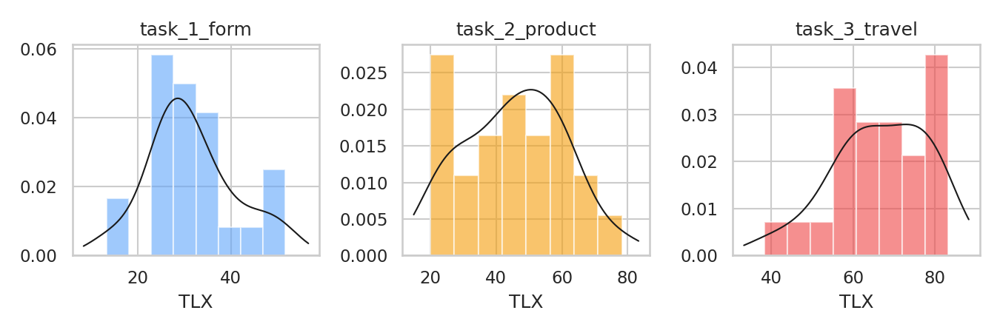
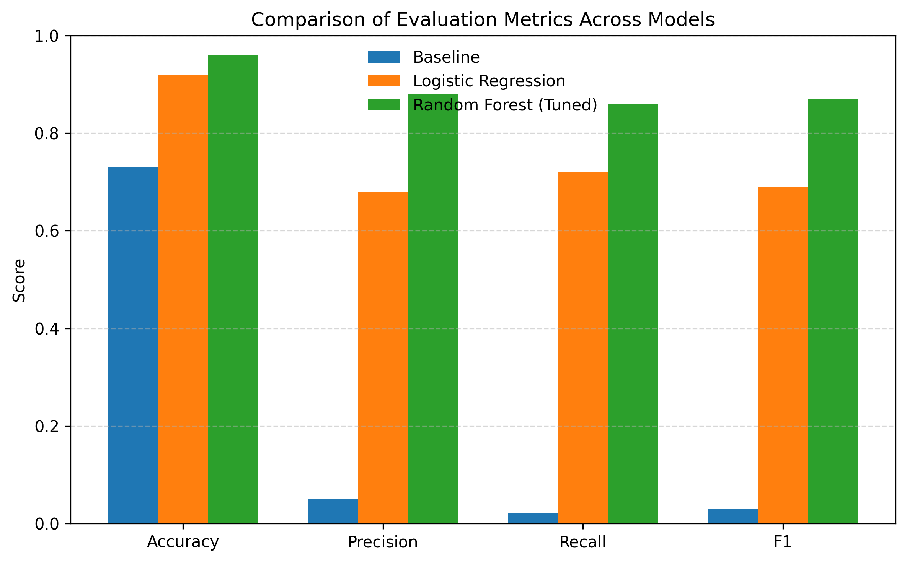
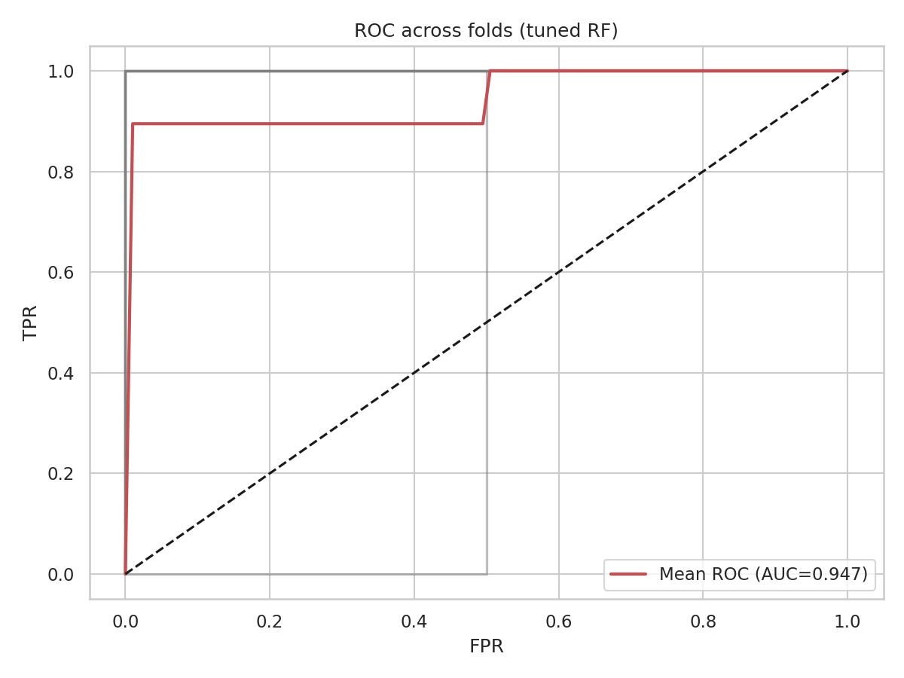
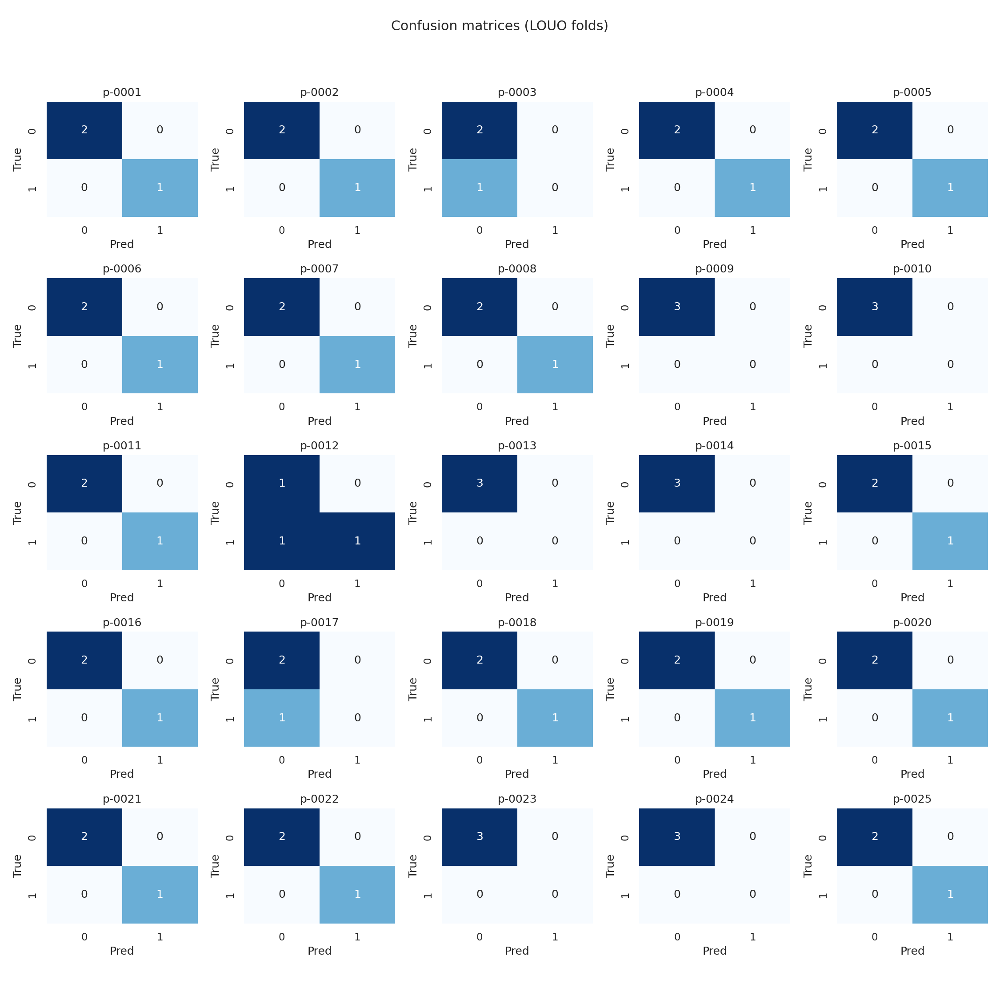
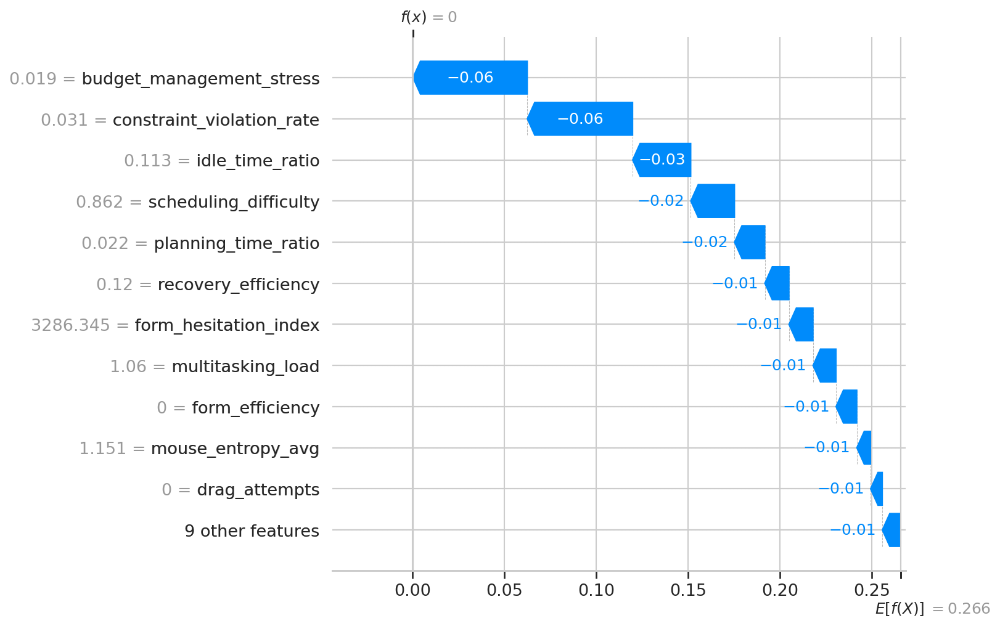
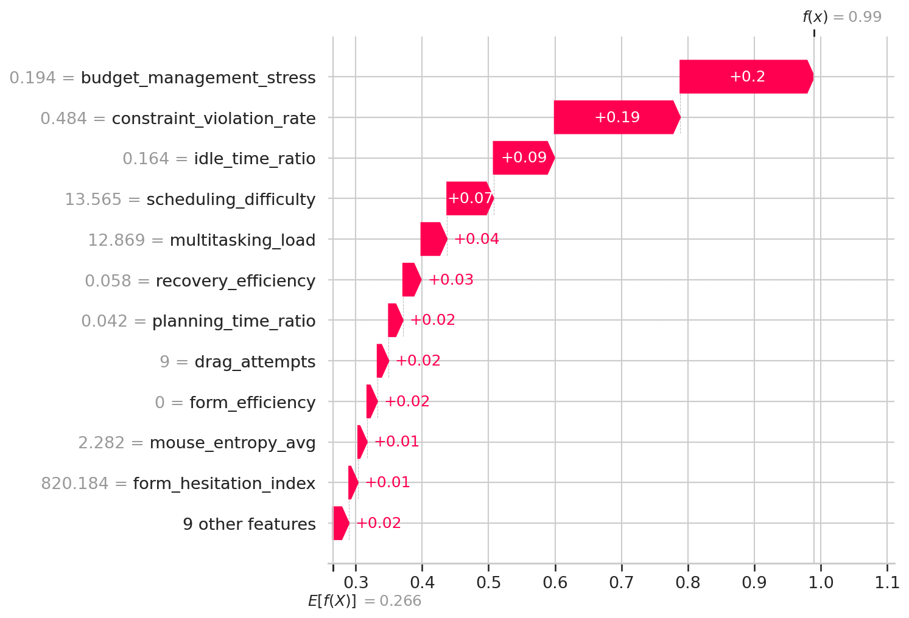

# CogniViz Results

## Overview

This document reports the empirical results obtained from evaluating CogniViz, a browser-native, sensor-free framework for real-time cognitive load inference from natural interaction behavior. The results address five core evaluation questions:

1. Can cognitive load be inferred reliably from interaction behavior alone?  
2. Do behavioral features generalize across users?  
3. How do behavioral indicators relate to subjective workload (NASA-TLX)?  
4. Are the model’s predictions interpretable and psychologically meaningful?  
5. Does the system operate within real-time constraints?

The evaluation integrates controlled task design, participant-independent machine learning, explainable modeling, and system-level performance analysis.

---

## 1. Task Difficulty Manipulation Check

To verify that the experimental tasks elicited systematically different levels of cognitive load, subjective workload was measured using the NASA Task Load Index (NASA-TLX).

### 1.1 NASA-TLX Distributions

Each participant completed the NASA-TLX questionnaire after each task, yielding 75 workload scores (25 participants × 3 tasks).

Mean TLX scores by task:

| Task                  | Mean TLX | Load Level |
|-----------------------|----------|------------|
| Form Completion       | ~28      | Low        |
| Product Exploration   | ~45      | Medium     |
| Travel Planning       | ~72      | High       |

The distributions exhibited a clear monotonic increase in perceived workload from Task 1 to Task 3.

---

### 1.2 Statistical Validation

A repeated-measures ANOVA confirmed a significant effect of task type on perceived workload:

- **p < .001**

Post-hoc pairwise comparisons showed that all task differences were statistically significant, with the travel-planning task producing substantially higher workload than both the form-completion and product-exploration tasks.

These results validate the experimental manipulation of task difficulty and establish a reliable cognitive load gradient across conditions.

---

## 2. Behavioral Correlates of Cognitive Load

To identify interaction behaviors most strongly associated with subjective workload, univariate Pearson correlations were computed between engineered behavioral features and NASA-TLX scores across all task instances (N = 75).

---

### 2.1 Strongest Positive Correlates

| Feature                    | Pearson r | p-value      |
|----------------------------|-----------|--------------|
| Scheduling difficulty      | 0.81      | < .001       |
| Constraint violation rate  | 0.80      | < .001       |
| Budget management stress   | 0.80      | < .001       |
| Multitasking load          | 0.73      | < .001       |
| Drag attempts              | 0.66      | < .001       |

These behaviors reflect planning complexity, constraint conflict, resource trade-off reasoning, and coordination overhead.

---

### 2.2 Strongest Negative Correlates

| Feature                | Pearson r | p-value      |
|------------------------|-----------|--------------|
| Recovery efficiency    | -0.62     | < .001       |
| Form efficiency        | -0.58     | < .001       |
| Form hesitation index  | -0.53     | < .001       |

These behaviors reflect fluent execution and efficient breakdown–repair cycles.

---

### 2.3 Interpretation

Perceived cognitive load was most strongly associated with:

- Repeated conflict resolution  
- Prolonged planning pauses  
- Multitasking behavior  
- Inefficient recovery from errors  

These findings align with cognitive load theory and breakdown–repair models of interaction.

---

## 3. Classification Performance

Cognitive load was operationalized as a binary classification target:

- **High Load:** NASA-TLX > 60  
- **Low Load:** NASA-TLX ≤ 60  

A Leave-One-User-Out (LOUO) cross-validation protocol was used to evaluate participant-independent generalization.

---

### 3.1 Model Comparison

| Model                | Accuracy | Precision | Recall | F1   | ROC-AUC |
|----------------------|----------|-----------|--------|------|---------|
| Majority Baseline    | 0.73     | 0.05      | 0.02   | 0.03 | 0.50    |
| Logistic Regression  | 0.92     | 0.68      | 0.72   | 0.69 | 0.84    |
| Random Forest (tuned)| 0.96     | 0.88      | 0.86   | 0.87 | 0.95    |

---

### 3.2 Interpretation

- The majority-class baseline achieved moderate accuracy due to class imbalance but failed to detect high-load states.
- Logistic Regression demonstrated that cognitive load signatures are strongly encoded in behavioral features.
- The tuned Random Forest achieved the strongest performance, indicating robust nonlinear interactions among behavioral signals.

The Random Forest model demonstrates strong participant-independent inference under constrained data.

---

## 4. Error Analysis

Misclassifications were infrequent and concentrated near borderline NASA-TLX values (≈55–62).

---

### 4.1 Systematic Error Modes

Two recurring discrepancy patterns emerged:

**Under-reporters**

- Participants exhibited clear behavioral difficulty  
- Reported relatively low NASA-TLX scores  
- Model predicted high cognitive load  

**Over-reporters**

- Participants reported high NASA-TLX scores  
- Exhibited efficient interaction behavior  
- Model predicted low cognitive load  

These discrepancies reflect known limitations of subjective workload assessment, including recall bias and individual calibration differences.

---

### 4.2 False Negatives

False negatives (high-load instances misclassified as low load) were rare.

This indicates that the model is conservative in overlooking genuinely strained users, which is desirable for adaptive interface deployment.

---

## 5. Explainability Results

Interpretability was treated as a first-class requirement.

SHAP (SHapley Additive exPlanations) was used to analyze model behavior.

---

### 5.1 Global SHAP Rankings

The most influential contributors to high-load predictions were:

1. Budget management stress  
2. Constraint violation rate  
3. Idle time ratio  
4. Scheduling difficulty  
5. Planning time ratio  

These features account for the majority of the model’s explanatory mass.

---

### 5.2 Interpretation

Behaviors reflecting:

- Constraint conflict  
- Resource trade-offs  
- Cognitive pausing  
- Planning complexity  

exert the strongest marginal influence on predictions.

Some features with strong univariate correlations (e.g., scheduling difficulty) contribute less marginal signal once correlated planning-related variance is accounted for.

---

## 6. Local Explanations

Local SHAP analyses decomposed individual predictions into additive feature contributions.

---

### 6.1 High-Load Instances

Predictions were driven by:

- Constraint violation rate  
- Budget management stress  
- Scheduling difficulty  
- Idle time ratio  

These reflect repeated conflict resolution attempts and prolonged planning effort.

---

### 6.2 Low-Load Instances

Predictions were dominated by:

- Recovery efficiency  
- Form efficiency  

These reflect fluent execution and rapid correction.

---

### 6.3 Borderline Instances

Mixed positive and negative feature contributions reflected competing behavioral signals near the decision threshold.

These instances highlight natural ambiguity in subjective workload reporting.

---

## 7. Explanation-Based Behavioral Clusters

To examine whether cognitive load manifests through recurring explanation patterns, SHAP attribution vectors were clustered.

---

### 7.1 Clustering Method

- SHAP vectors corresponding to the high-load class were extracted  
- Dimensionality reduction via PCA  
- K-means clustering (k = 2)  

---

### 7.2 Cluster Profiles

**Cluster 1: Conflict-Dominated Breakdown**

- High contributions from:
  - Constraint violation rate  
  - Budget management stress  
  - Idle time ratio  
  - Scheduling difficulty  

Reflects cognitive strain driven by constraint conflict and resource trade-offs.

---

**Cluster 2: Efficient Execution Under Complexity**

- Lower or negative SHAP contributions across planning-related features  
- Higher recovery efficiency  

Reflects fluent interaction under structurally complex tasks.

---

### 7.3 Interpretation

Cluster membership was not determined by task label alone.

Some high-load task instances appeared in the lower-impact cluster, indicating efficient navigation of complex tasks.

This suggests that cognitive load is expressed heterogeneously across users.

---

## 8. Real-Time System Performance

CogniViz was evaluated as a deployed, real-time system.

---

### 8.1 Latency

| Metric                  | Value        |
|--------------------------|--------------|
| Model inference time     | ~5–10 ms     |
| Median end-to-end latency| ~210 ms      |
| 95th percentile latency | ~338 ms      |
| Maximum latency         | < 400 ms     |

These values satisfy real-time responsiveness requirements for interactive systems.

---

### 8.2 Stability

Temporal smoothing and hysteresis prevented reactive or jittery adaptation.

Load transitions required sustained evidence across multiple windows.

---

## 9. Summary of Findings

The results demonstrate that:

- Cognitive load can be reliably inferred from interaction behavior alone  
- Behavioral features generalize across users  
- Predictions align with subjective workload while revealing its limitations  
- Interpretability clarifies how predictions are formed  
- Cognitive load emerges from breakdown–repair dynamics  
- The system operates within real-time constraints  

---

## 10. Implications

The findings support the following principles:

- Constraint conflict and planning complexity dominate cognitive load  
- Fluent recovery buffers against overload  
- Interpretability is essential for adaptive interfaces  
- Adaptation should be proportional and explanation-driven  

