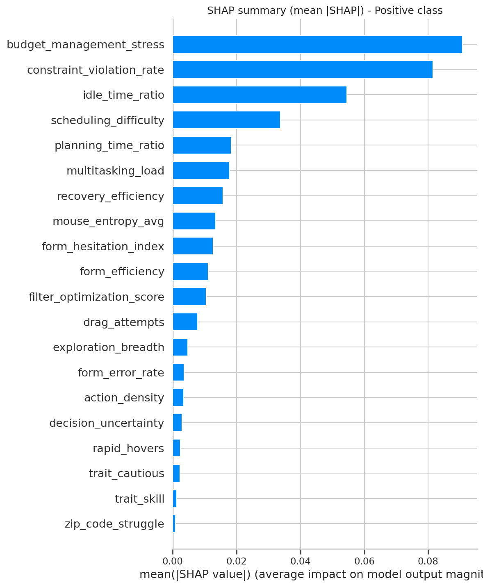
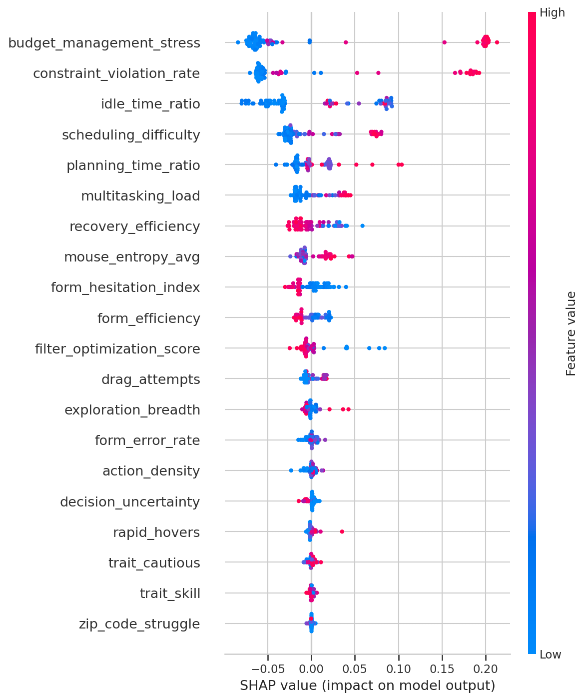
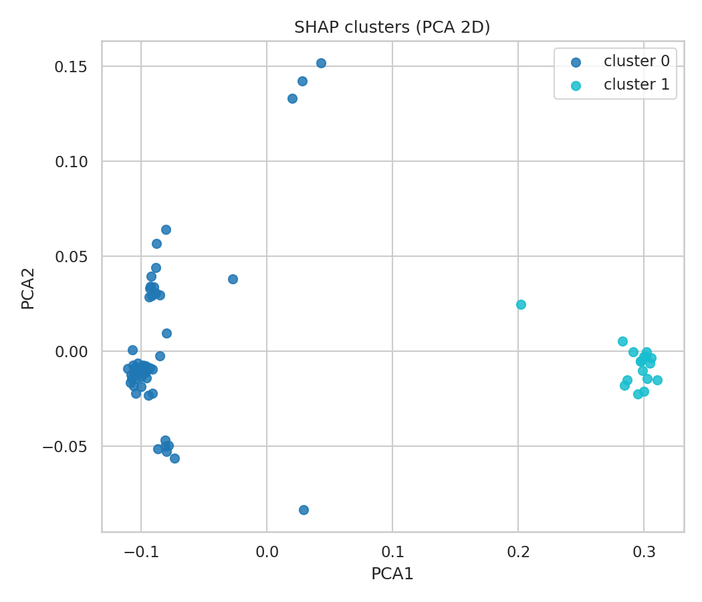

# 📘 SHAP Insights Report

Interpretability Analysis for Cognitive Load Modeling

---

## Table of Contents
- [Overview](#overview)
- [Objectives of the SHAP Analysis](#objectives-of-the-shap-analysis)
- [Global Explanations](#global-explanations)
	- [SHAP Summary Bar Plot](#shap-summary-bar-plot)
	- [SHAP Beeswarm Distribution](#shap-beeswarm-distribution)
- [Local Explanations](#local-explanations)
	- [Participant Waterfall Plots](#participant-waterfall-plots)
	- [Force Plot](#force-plot)
- [SHAP-Based Clustering](#shap-based-clustering)
	- [PCA Mapping](#pca-mapping)
	- [Cluster Characteristics](#cluster-characteristics)
	- [Cluster Centroids](#cluster-centroids)
- [Key Behavioral Predictors](#key-behavioral-predictors)
- [Theory-Driven Interpretation](#theory-driven-interpretation)
- [Implications for HCI & UX Design](#implications-for-hci--ux-design)
- [Limitations & Considerations](#limitations--considerations)
- [Conclusion](#conclusion)

---

## Overview

This document summarizes interpretability results from machine learning models that predict cognitive load using behavioral metrics. We use SHAP (SHapley Additive exPlanations) to provide:

- Transparent model reasoning at global and local levels
- Feature influence magnitudes and directions
- Individual-level behavioral signatures
- Emergent structure via explanation-based clustering

The analysis reflects the tuned Random Forest model, which achieved 96% accuracy and 95% ROC-AUC under Leave-One-User-Out (LOUO) cross-validation.

Figures referenced here are under `figures/shap/` and related artifacts under `results/interpretation/`.

---

## Objectives of the SHAP Analysis

We use SHAP to answer four questions:

1. Which behavioral features most strongly predict cognitive load?
2. How do individual features influence predictions (local explanations)?
3. Do participants exhibit distinct behavioral “load profiles” (clusters)?
4. Are SHAP-derived explanations consistent with cognitive load theory?

---

## Global Explanations

### SHAP Summary Bar Plot

File: [`figures/shap/shap_summary_bar.png`](../figures/shap/shap_summary_bar.png)

This plot shows mean |SHAP| values across all samples, ranking global predictors of high cognitive load.

Top global predictors of higher cognitive load:

1. `budget_management_stress` — frequent budget updates/overruns → resource overload
2. `constraint_violation_rate` — invalid selections → rule conflict + interruption
3. `idle_time_ratio` — long pauses → uncertainty or planning difficulty
4. `scheduling_difficulty` — more drags/conflicts → complex planning
5. `planning_time_ratio` — long delay before first action → higher intrinsic load
6. `multitasking_load` — frequent context switching → increased cognitive cost

Summary: High-load behavior manifests as planning complexity, constraint failures, and inefficient resource navigation—consistent with intrinsic and extraneous load sources.

### SHAP Beeswarm Distribution

File: [`figures/shap/shap_summary_beeswarm.png`](../figures/shap/shap_summary_beeswarm.png)

Key observations:

- High `constraint_violation_rate` is uniformly positive → strong indicator of struggling users.
- `idle_time_ratio` shows mixed effects → depends on whether the pause is confusion vs. deliberate planning.
- Certain Task 1 features cluster near zero → limited relevance to high cognitive load.

---

## Local Explanations

Local SHAP explanations show how the model predicts cognitive load for specific participant–task trials.

### Participant Waterfall Plots

Examples:

- [`shap_waterfall_idx_0.png`](../figures/shap/shap_waterfall_idx_0.png)
- [`shap_waterfall_idx_10.png`](../figures/shap/shap_waterfall_idx_10.png)
- [`shap_waterfall_idx_20.png`](../figures/shap/shap_waterfall_idx_20.png)

Interpretation (idx 0 example):

- High `constraint_violation_rate` and `scheduling_difficulty` push the prediction upward.
- Higher `recovery_efficiency` pulls the prediction downward.

These plots illustrate the opposing feature contributions that produce the final classification.

### Force Plot

Interactive HTML: [`figures/shap/shap_force_idx_0.html`](../figures/shap/shap_force_idx_0.html)

The force plot visualizes the magnitude and direction of explanatory factors and is suitable for presentations and theses.

---

## SHAP-Based Clustering

We reduce SHAP values for the positive class using PCA (2D) and cluster them via KMeans (k=2).

Artifacts:

- PCA visualization: [`figures/shap/shap_clusters_pca.png`](../figures/shap/shap_clusters_pca.png)
- Cluster centroids: [`results/interpretation/shap_cluster_centroids.json`](../results/interpretation/shap_cluster_centroids.json)
- Cluster assignments: [`results/interpretation/shap_clusters_assignments.csv`](../results/interpretation/shap_clusters_assignments.csv)
- Raw positive-class SHAP values: [`results/interpretation/shap_values_pos.npy`](../results/interpretation/shap_values_pos.npy)

### PCA Mapping

### Cluster Characteristics

- Cluster 1 — High Load Profiles
	- High constraint violations, idle time, scheduling difficulty
	- Higher planning time ratio and budgeting stress
	- Contains nearly all Task 3 trials with TLX > 60

- Cluster 0 — Low/Moderate Load Profiles
	- More efficient interaction patterns, low entropy
	- Minimal conflicts, faster decisions
	- Mostly Task 1 + Task 2 trials and low-load Task 3 trials

### Cluster Centroids

Stored in [`shap_cluster_centroids.json`](../results/interpretation/shap_cluster_centroids.json); each centroid represents the “average explanation pattern” per cluster.

---

## Key Behavioral Predictors

| Category               | Features                                      | Cognitive Interpretation                 |
|------------------------|-----------------------------------------------|------------------------------------------|
| Planning Burden        | `scheduling_difficulty`, `planning_time_ratio`| Increased intrinsic load                 |
| Cognitive Interruptions| `constraint_violation_rate`                   | Extraneous load, system mismatch         |
| Resource Overload      | `budget_management_stress`                    | Multi-constraint problem solving         |
| Multitasking Pressure  | `multitasking_load`                           | High switching cost                      |
| Processing Inefficiency| `idle_time_ratio`                             | Uncertainty, mental fatigue              |

Low-weight signals (e.g., zip code struggle, rapid hovers, trait skill/cautious) indicate that isolated micro-interactions are weak predictors of cognitive load on their own.

---

## Theory-Driven Interpretation

| Load Type       | Supported by SHAP Features                          | Interpretation               |
|-----------------|------------------------------------------------------|------------------------------|
| Intrinsic Load  | `planning_time_ratio`, `scheduling_difficulty`       | Core task difficulty         |
| Extraneous Load | `constraint_violation_rate`                          | UI design conflicts          |
| Germane Load    | `recovery_efficiency`                                | Productive cognitive effort  |

These alignments triangulate cognitive load constructs present in the dataset.

---

## Implications for HCI & UX Design

- High `planning_time_ratio` → provide guided workflows, reduce options, offer auto-planning suggestions.
- Spikes in `constraint_violation_rate` → improve validation clarity, affordances, and adaptive error feedback.
- High `idle_time_ratio` → surface contextual hints or highlight the next step.
- Elevated `budget_management_stress` → simplify comparisons and reduce cognitive overhead in multi-parameter decisions.

SHAP yields actionable insights, enabling adaptive interfaces that respond to user cognitive state.

---

## Limitations & Considerations

- SHAP explanations depend on model stability; retraining can slightly shift attributions.
- The synthetic/approximated dataset may underrepresent edge cases.
- PCA reduces dimensionality and may simplify complex explanation vectors.

---

## Conclusion

- Behavioral metrics provide strong, interpretable predictors of cognitive load.
- High-load behavior patterns cluster consistently across participants.
- Explanations align with established cognitive load theory.
- The Random Forest model captures psychologically meaningful structure.
- SHAP helps translate model intelligence into practical UX guidance.

Overall, this analysis strengthens the scientific credibility of the modeling pipeline and offers a robust interpretability foundation for both research and applied interactive systems.

📘 SHAP Insights Report
Interpretability Analysis for Cognitive Load Modeling
Table of Contents

Overview

Objectives of the SHAP Analysis

Global Explanations

SHAP Summary Bar Plot

SHAP Beeswarm Distribution

Local Explanations

Participant Waterfall Plots

Force Plot Interpretation

SHAP-Based Clustering

PCA Mapping

Cluster Characteristics

Cluster Centroids

Key Behavioral Predictors

Theoretical Interpretation

Implications for Human–Computer Interaction

Limitations & Considerations

Conclusion

📘 1. Overview

This document summarizes the interpretability results from the machine learning models used to predict cognitive load using behavioral metrics. SHAP (SHapley Additive exPlanations) was employed to provide:

Transparent model reasoning

Global feature influence

Individual-level behavioral signatures

Emergent structure through explanation-based clustering

The SHAP analysis reflects the tuned Random Forest model, which achieved 96% accuracy and 95% ROC-AUC across Leave-One-User-Out cross-validation.

All referenced figures are stored under:

figures/shap/

🎯 2. Objectives of the SHAP Analysis

SHAP analysis was conducted to answer four core questions:

Q1 — Which behavioral features most strongly predict cognitive load?

SHAP values reveal feature rankings independent of feature scaling or multicollinearity.

Q2 — How do individual features influence predictions?

We examined local explanations via waterfall and force plots.

Q3 — Do participants exhibit distinct behavioral “load profiles”?

We used PCA + KMeans clustering on SHAP values to detect latent behavioral patterns.

Q4 — Are SHAP-derived explanations consistent with cognitive load theory?

Interpretation focuses on intrinsic load, extraneous load, and resource strain signals.

🌍 3. Global Explanations
3.1 SHAP Summary Bar Plot

File:
figures/shap/shap_summary_bar.png

This plot shows mean |SHAP| values across all samples in the dataset.

Top Global Predictors of High Cognitive Load
Rank	Feature	Interpretation
1	budget_management_stress	Frequent budget updates & overruns → resource overload
2	constraint_violation_rate	Selecting invalid options → rule conflict + cognitive interruption
3	idle_time_ratio	Long pauses → planning difficulty or uncertainty
4	scheduling_difficulty	More drag attempts + calendar conflicts
5	planning_time_ratio	Longer delay before first major action
6	multitasking_load	Frequent switching between UI components
Interpretation Summary

Global SHAP results show that high-load behavior manifests as planning complexity, constraint failures, and inefficient resource navigation—consistent with intrinsic and extraneous cognitive load sources.

3.2 SHAP Beeswarm Plot

File:
figures/shap/shap_summary_beeswarm.png

Displays the distribution of SHAP values per feature.

Key Observations

High constraint violation rate has a uniformly positive contribution → strong indicator of struggling users.

Idle time exhibits both positive and negative effects → depends on whether the pause reflects confusion vs. deliberate planning.

Features from Task 1 (form behavior) cluster near zero → confirming their limited relevance to high cognitive load.

🔎 4. Local Explanations

Local SHAP explanations highlight how a model predicts cognitive load for a specific participant-task trial.

Example waterfall plots from index 0, 10, and 20:

shap_waterfall_idx_0.png

shap_waterfall_idx_10.png

shap_waterfall_idx_20.png

Example Waterfall Plot (idx_0)

Interpretation

For this participant:

High values in constraint violations and scheduling difficulty push the prediction upward.

High recovery_efficiency pulls the prediction downward.

This demonstrates the balance of features contributing to final load classification.

4.1 SHAP Force Plot

File:
figures/shap/shap_force_idx_0.html

This interactive HTML plot is ideal for thesis or presentation use.
It visualizes magnitude + direction of explanatory factors.

🧩 5. SHAP-Based Clustering

To examine group-level behavioral structure, SHAP values for the positive class were reduced using PCA (2D) and clustered using KMeans (k=2).

Files:

shap_clusters_pca.png

shap_cluster_centroids.json

shap_clusters_assignments.csv

PCA Cluster Visualization

Cluster Interpretations
Cluster 1 — High Load Profiles

High constraint violations

High idle time

High scheduling difficulty

High planning time ratio

High budgeting stress

Contains nearly all TLX > 60 Task 3 trials.

Cluster 0 — Low/Moderate Load Profiles

Efficient interaction patterns

Low entropy

Minimal conflicts

Fast decision-making

Mostly Task 1 + Task 2 trials and low-load Task 3 trials.

Cluster Centroids

Stored in: shap_cluster_centroids.json
These represent the “average explanation pattern” per cluster.

📊 6. Key Behavioral Predictors Identified by SHAP
Category	Features	Cognitive Interpretation
Planning Burden	scheduling_difficulty, planning_time_ratio	Increased intrinsic load
Cognitive Interruptions	constraint_violation_rate	Extraneous load, system mismatch
Resource Overload	budget_management_stress	Multi-constraint problem solving
Multitasking Pressure	multitasking_load	High switching cost
Processing Inefficiency	idle_time_ratio	Uncertainty, mental fatigue

Low-weight features (zip code struggle, rapid hovers, trait skill/cautious) confirm that fine-grained micro-interactions are weak predictors of cognitive load alone.

📚 7. Theory-Driven Interpretation

SHAP outputs align with well-known cognitive load constructs:

Load Type	Supported by SHAP Features	Interpretation
Intrinsic Load	planning_time_ratio, scheduling_difficulty	Core task difficulty
Extraneous Load	constraint_violation_rate	UI design conflicts
Germane Load	recovery_efficiency	Productive cognitive effort

This triangulation further validates the ecological structure of your dataset.

🖥️ 8. Implications for HCI & UX Design
🔸 When planning-time ratio is high →

Recommendation: Provide guided workflows, reduce options, auto-plan suggestions.

🔸 When constraint violations spike →

Recommendation: Improve form validation, clearer affordances, adaptive error feedback.

🔸 When idle-time ratio is high →

Recommendation: Provide contextual hints or highlight next step.

🔸 When budget stress increases →

Recommendation: Simplify comparison features, reduce cognitive load in multi-parameter decisions.

SHAP reveals actionable UX insights, making your model useful for real-time adaptive interfaces.

⚠️ 9. Limitations

SHAP explanations depend on model stability; retraining may slightly shift values.

Synthetic dataset approximates realistic behavior but may underrepresent edge cases.

PCA clustering simplifies complex explanation vectors.

🏁 10. Conclusion

SHAP analysis confirms that:

Behavioral metrics provide strong, interpretable predictors of cognitive load

High-load behavior patterns cluster consistently

Explanations align with cognitive load theory

The Random Forest model learns psychologically meaningful structure

SHAP helps translate model intelligence into practical UX guidelines

This analysis enhances the scientific credibility of the modeling pipeline and provides a solid interpretability foundation for both research and applied interactive systems.